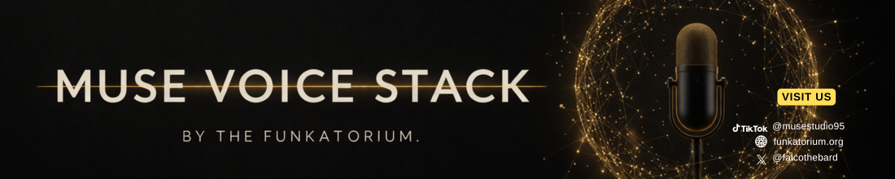

<p align="center">
  
</p>

<p align="center">
  
</p>

Your AI doesn’t just think — it speaks, listens, and remembers.  
This is a Telegram-first voice layer that sends voice updates out, ingests voice notes in, and stores transcripts into **your** memory backend.

## What it includes

- **Telegram transport** (outbound + inbound)
- **Kokoro TTS** via MUSE TTS (**54 voices**) for outbound voice notes
- **faster-whisper STT** for inbound voice transcription (local, fast, private-friendly)
- **Pluggable transcript sink**: local file, webhook, or MUSE Brain MCP adapter

### What is Kokoro here?
Kokoro is the voice engine behind MUSE TTS. You get **54 voices** and can pick a default persona voice without changing core logic.

### What is faster-whisper here?
`faster-whisper` is a lightweight speech-to-text server you can run locally.  
In this repo it exposes an OpenAI-compatible transcription endpoint, so the bridge can call it like any standard STT API.

## Where transcripts go

Choose one with `MEMORY_SINK_MODE`:

- `file` (default): writes NDJSON to `./state/transcripts.ndjson`
- `webhook`: POSTs transcripts to your own endpoint
- `mcp`: sends transcripts to MUSE Brain via `mind_observe` (optional adapter)

## Vibe-coder friendly (entry level)

- You can run this with copy/paste setup + `.env`.
- No need to train models.
- Start local with sane defaults, then swap providers later.
- Works even if you keep your own stack and only want the Telegram+voice piece.

## Quick start

```bash
cp .env.example .env
npm install
npm run build
```

By default transcripts are saved locally (`MEMORY_SINK_MODE=file`), so no MUSE dependency is required.

Start STT sidecar:

```bash
python3 -m venv .venv
source .venv/bin/activate
pip install -r stt/requirements.txt
python stt/faster_whisper_server.py
```

Start bridge:

```bash
npm run bridge
```

Send demo message:

```bash
npm run demo:notify
```

For the full setup flow see `docs/QUICKSTART.md`.
